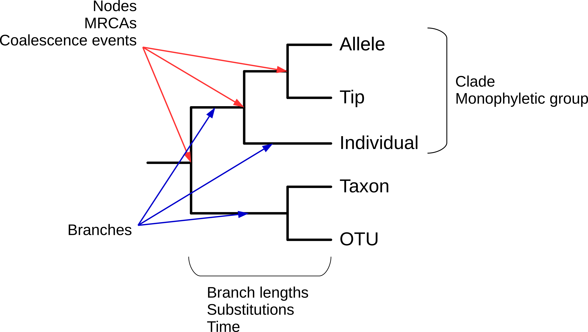
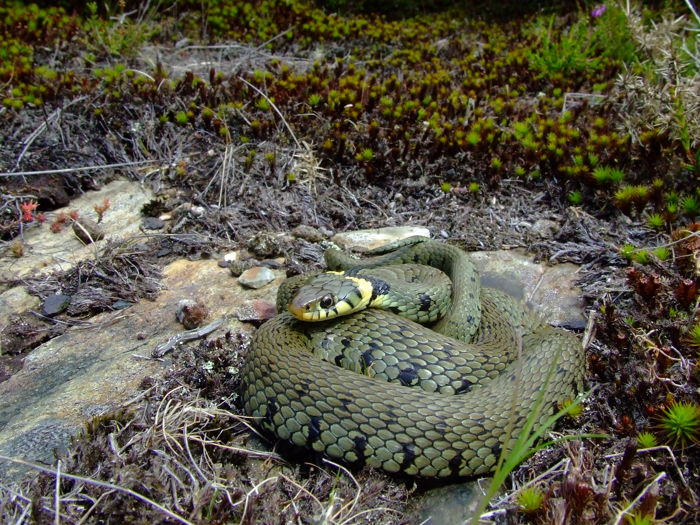
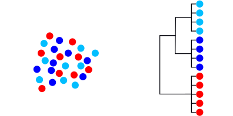
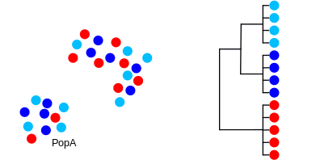
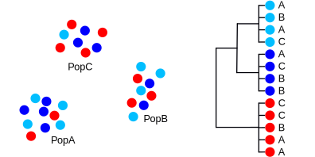
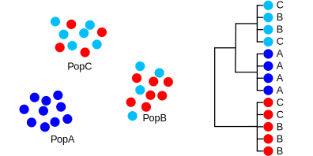
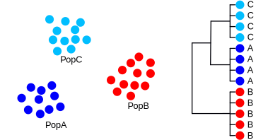
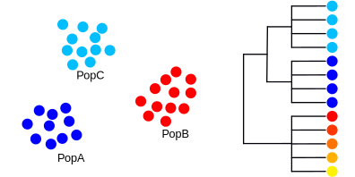
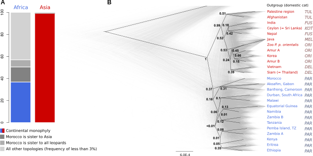
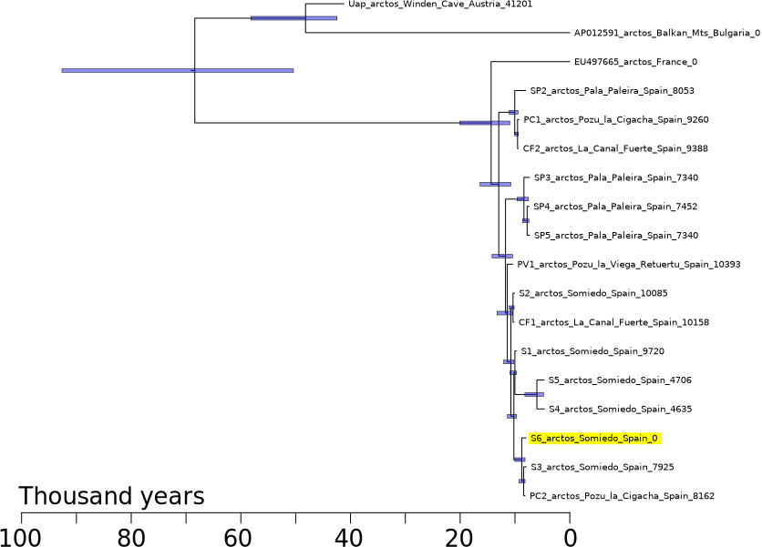

```{r setup, include = FALSE}
library(tidyverse)
library(RColorBrewer)
library(knitr)
```

<!-- adding bold and italic options -->
<style>
em {
  font-style: italic
}
strong {
  font-weight: bold;
}
</style>

## Gene trees and molecular dating

- What are gene trees?
- What can they be used for?
- What shapes the gene tree?
- Calibrating trees

---

## Gene tree

- Evolutionary history of a genetic locus, represented as a tree
- (not always an actual gene)
- Can be used to infer species or population histories*
- Any recombining genome has multiple loci, each with its own gene tree
- Easy to calculate using genetic data (often sequences)

---

## Gene tree terminology

```{r, out.width = "90%", dpi = 300, echo = FALSE, fig.align = "center"}
  
```

--- .segue .dark 

## What can we use gene trees for?

---

## Gene trees in Molecular Ecology

```{r, out.width = "80%", dpi = 300, echo = FALSE, fig.align = "center"}
  
```

---

## Grass snakes

```{r, out.width = "70%", dpi = 300, echo = FALSE, fig.align = "center"}
  
```

---

## Grass snakes

```{r, out.width = "100%", out.height=500, dpi = 300, echo = FALSE}
include_graphics("./assets/img/2013-Mitochondrial_phylogeography_contact_zones_and_taxonomy_of_grass_snakes_(Natrix_natrix_N._megalocephala).pdf")
```

---

## Glacial refugia

```{r, out.width = "100%", dpi = 300, echo = FALSE, fig.align = "center"}
  include_graphics("./assets/img/LGM_Europe_Map_v1.png")
```

--- .segue .dark 

## What shapes the gene tree?

---

## An example

```{r, out.width = "100%", dpi = 300, echo = FALSE, fig.align = "center", fig.cap=""}
  
```

---

## An example

```{r, out.width = "100%", dpi = 300, echo = FALSE, fig.align = "center", fig.cap=""}
  
```

---

## An example

```{r, out.width = "100%", dpi = 300, echo = FALSE, fig.align = "center", fig.cap=""}
  
```

---

## An example

```{r, out.width = "100%", dpi = 300, echo = FALSE, fig.align = "center", fig.cap=""}
  
```

---

## An example

```{r, out.width = "100%", dpi = 300, echo = FALSE, fig.align = "center", fig.cap=""}
  
```

---

## An example

```{r, out.width = "100%", dpi = 300, echo = FALSE, fig.align = "center", fig.cap=""}
  
```

---

## Observations

- Drift sorts the lineages into clades
- This takes time, we can't detect the divergence immediately
- We go through stages of complete/incomplete monophyly
- Mutation builds upon the clades, monophyly is retained [unless there is gene flow]
- In this example, the phylogeny does not represent the sequence of population splits
- The phylogenetic divergence times are older than the population splits
- Each locus goes through its own history of lineage sorting
- The unpredictability is reduced with smaller population sizes and older splits [more drift]
- These processes are the same for species-level phylogenies

--- &twocol

## Evidence from whole genome analysis

*** =left

```{r, out.width = "100%", dpi = 300, echo = FALSE, fig.align = "center", fig.cap=""}
  include_graphics("./assets/img/cave_mono.svg")
```

*Barlow et al. 2018. Nat. Ecol. Evol*

*** =right

- Brown bear, polar bear, extinct cave bears
- Aligned nuclear genomes, divided into 25 kb blocks
- Only 50 % of blocks show the correct species relationships
- Rest are a mix of all possible topologies

---

## Gene trees summary

- Can identify population divergence/speciation events
- And the relationships between these populations/species
- Issues of lineage sorting effects
- Accuracy improves with old events involving small populations (more drift)
- Generally we look at many  gene trees for a better overview

---

## Multilocus phylogenetics

```{r, out.width = "100%", dpi = 300, echo = FALSE, fig.align = "left", fig.cap=""}
  include_graphics("./assets/img/leopar_res.svg")
```

---

## Multilocus phylogenetics

```{r, out.width = "100%", dpi = 300, echo = FALSE, fig.align = "left", fig.cap=""}
  
```

---

## Multilocus phylogenetics

```{r, out.width = "100%", out.height=500, dpi = 300, echo = FALSE, fig.cap=""}
include_graphics("./assets/img/Paijmans et al. - 2021 - African and Asian leopards are highly differentiated at the genomic level.pdf")
```


--- .segue .dark 

## Calibrating trees

--- &vcenter

## Branch length are typically scaled to genetic distance

```{r, out.width = "100%", dpi = 300, echo = FALSE, fig.align='left', fig.cap=""}
  
```

--- &vcenter

## Imagine if they could be scaled to time

```{r, out.width = "100%", dpi = 300, echo = FALSE, fig.align='left', fig.cap=""}
  
```

--- .class bg:white

## Molecular clock hypothesis

- Substitutions seem to occur at an approximately constant rate
- This means genetic distance is proportional to time
- Sometimes the relationship breaks down (divergent lineages, saturation, selection)
- At the population level it generally works well

```{r, out.width = "60%", fig.width = 5, fig.height = 3, dpi = 600, fig.align = "center", echo = FALSE, fig.cap=""}
t <- read.table("./assets/data/clock.txt", header=TRUE)
par(mar=c(4,4,1,1))
plot(jitter(t$time), jitter(t$div, factor=15), pch=19, col="red", xlab="time (years)", ylab="genetic distance")
abline(lm(t$div ~ t$time))
```

--- .class #id

## Methods of calibrating the tree

- If we assume a molecular clock, we can use external sources of information to calibrate the tree
- **Genetic distance per unit time**

### There are 3 (interdependent) parameters of interest:

- **Node ages**: population divergence times, fossils, or unknown
- **Substitution rate**: previous estimates, related species, or unknown
- **Tip ages**: sampling dates, radiocarbon ages, or unknown


--- bg:white

## Calibration priors

- Frequently Bayesian analyses are used for molecular dating are used 
- Allows calibration to be input as a distribution, incorporating the uncertainty
- The age distribution of unknown tips/node/sub rates can also be estimated

```{r, out.width = "70%", fig.width = 5, fig.height = 3, dpi = 600, fig.align = "center", echo = FALSE, fig.cap=""}
hist(rlnorm(10000, log(10), log(2)), breaks=100, 
     xlim=c(-10,100), axes=FALSE,
     xlab="million years", ylab="probability", col="lightblue",
     main="Fossil 12 Ma, fossil record good"
)
axis(1, at=c(-10, 40, 90), labels=c(0,50,100))
axis(2, labels=FALSE)
```

--- &twocol

## Calibration priors

*** =left

```{r, out.width = "100%", fig.width = 5, fig.height = 5, dpi = 600, fig.align = "center", echo = FALSE, fig.cap=""}
hist(rnorm(10000, 30, 0.5), breaks=100, axes=FALSE,
     xlab="thousand years", ylab="probability", col="lightblue",
     main="Radiocarbon date with uncertainty"
)
axis(1)
axis(2, labels=FALSE)
```

*** =right

```{r, out.width = "100%", fig.width = 5, fig.height = 5, dpi = 600, fig.align = "center", echo = FALSE, fig.cap=""}
hist(runif(10000, min = 10, max = 100), breaks=50, axes=FALSE,
     xlab="million years", ylab="probability", col="lightblue", xlim=c(0,120),
     main="Fossil 10 Ma, poor fossil record"
)
axis(1)
axis(2, labels=FALSE)
```


--- .class #id

## Brown bears

- Radiocarbon dates, estimate substitution rate, coalescence times, and an unknown age

```{r, out.width = "65%", dpi = 300, echo = FALSE, fig.align='center', fig.cap=""}
  
```


--- &twocol

## Sabretooth cat genera

- When did they diverge from living cats?
- How diverged are they from one another?

*** =left

### *Smilodon*

```{r, out.width = "100%", dpi = 300, echo = FALSE, fig.align='center', fig.cap=""}
include_graphics("./assets/img/smilodon_skull.jpg")
```

*** =right

### *Homotherium*

```{r, out.width = "100%", dpi = 300, echo = FALSE, fig.align='center', fig.cap=""}
include_graphics("./assets/img/Homotherium_serum.jpg")
```

*Sergiodlarosa, CC BY-SA 3.0*

---

## Uniform calibration priors
Fossil|Fossil Constraint|Calibration Prior
---|---|---
Genetta fossil: 11.2 Ma|minimum 11.2 Ma|uniform: 50–11.2 Ma
Hyaenid fossil: 16.4 Ma|minimum 16.4 Ma|uniform: 50–16.4 Ma
Herpestid fossil: 16.4 Ma|minimum 16.4 Ma|uniform: 50–16.4 Ma
Felidae stem fossils, Prionodon fossils|minimum 28 Ma|uniform: 50–28 Ma
Lynx fossil: 5.3 Ma|minimum 5.3 Ma|uniform: 10–5.3 Ma
Acinonyx fossils: 3.8 Ma|minimum 3.8 Ma|uniform: 10–3.8 Ma
Caracal and serval fossils: 3.8 Ma|minimum 3.8 Ma|uniform: 16–3.8 Ma
Oldest Panthera fossil: 3.8 Ma|minimum 3.8 Ma|uniform: 16–3.8 Ma
Oldest Panthera tigris fossil: 1.5 Ma|minimum 1.5 Ma|uniform: 10–1.5 Ma

---

## Molecular dating of sabretooth cats

```{r, out.width = "85%", dpi = 300, echo = FALSE, fig.align='center', fig.cap=""}
include_graphics("./assets/img/sabre_tree.svg")
```

---

## Molecular dating of sabretooth cats

```{r, out.width = "100%", out.height=500, dpi = 300, echo = FALSE, fig.cap=""}
include_graphics("./assets/img/Paijmans et al. - 2017 - Evolutionary History of Saber-Toothed Cats Based o.pdf")
```

--- &thankyou

## Next time:

**Ancient DNA 1**


