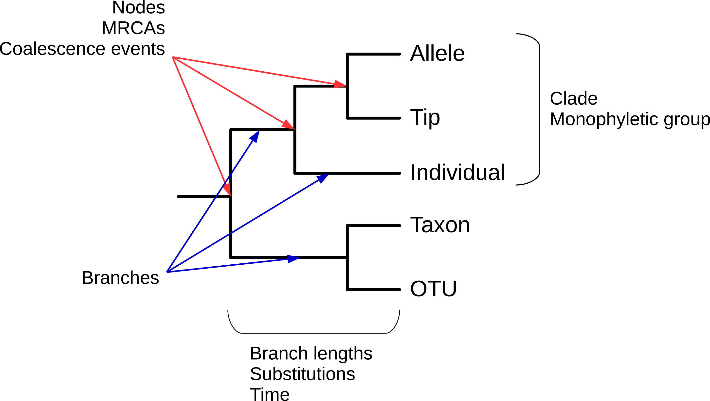
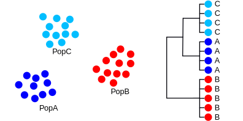
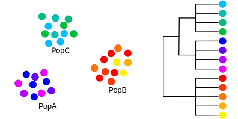

<!-- adding bold and italic options -->

## Gene trees and molecular dating

- What are gene trees?
- What can they be used for?
- What shapes the gene tree?
- Calibrating trees

---

## Gene tree

- Evolutionary history of a genetic locus, represented as a tree
- (not always an actual gene)
- Can be used to infer species or population histories*
- Any recombining genome has multiple loci, each with its own gene tree
- Easy to calculate using genetic data (often sequences)

---

## Gene tree terminology

--- .segue .dark 

## What can we use gene trees for?

---

## Gene trees in Molecular Ecology

---

## Grass snakes

---

## Grass snakes

<embed src="./assets/img/2013-Mitochondrial_phylogeography_contact_zones_and_taxonomy_of_grass_snakes_(Natrix_natrix_N._megalocephala).pdf" title="plot of chunk unnamed-chunk-4" width="100%" height="500" type="application/pdf" />

---

## Glacial refugia

--- .segue .dark 

## What shapes the gene tree?

---

## Allele evolution

---

## An example

---

## An example

---

## An example

---

## An example

---

## An example

---

## An example

---

## Observations

- Drift sorts the lineages into clades
- This takes time, we can't detect the divergence immediately
- We go through stages of complete/incomplete monophyly
- Mutation builds upon the clades, monophyly is retained [unless there is gene flow]
- In this example, the phylogeny does not represent the sequence of population splits
- The phylogenetic divergence times are older than the population splits
- Each locus goes through its own history of lineage sorting
- The unpredictability is reduced with smaller population sizes and older splits [more drift]
- These processes are the same for species-level phylogenies

--- &twocol

## Evidence from whole genome analysis

*** =left

*Barlow et al. 2018. Nat. Ecol. Evol*

*** =right

- Brown bear, polar bear, extinct cave bears
- Aligned nuclear genomes, divided into 25 kb blocks
- Only 50 % of blocks show the correct species relationships
- Rest are a mix of all possible topologies

--- .segue .dark 

## Calibrating trees

--- &vcenter

## Branch length are typically scaled to genetic distance

--- &vcenter

## Imagine if they could be scaled to time

--- .class bg:white

## Molecular clock hypothesis

- Substitutions seem to occur at an approximately constant rate
- This means genetic distance is proportional to time
- Sometimes the relationship breaks down (divergent lineages, saturation, selection)
- At the population level it generally works well

--- .class #id

## Methods of calibrating the tree

- If we assume a molecular clock, we can use external sources of information to calibrate the tree
- **Genetic distance per unit time**

### There are 3 (interdependent) parameters of interest:

- `tip ages`
- `node ages`
- `substitution rate`

--- &twocol

## Sabretooth cat genera

- When did they diverge from living cats?
- How diverged are they from one another?

*** =left

### *Smilodon*

*** =right

### *Homotherium*

*Sergiodlarosa, CC BY-SA 3.0*

---

## Molecular dating of sabretooth cats

--- &thankyou

## Next time:

**Ancient DNA 1**

